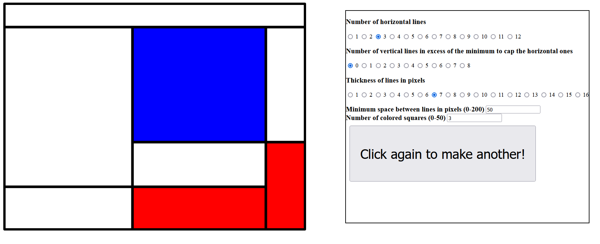
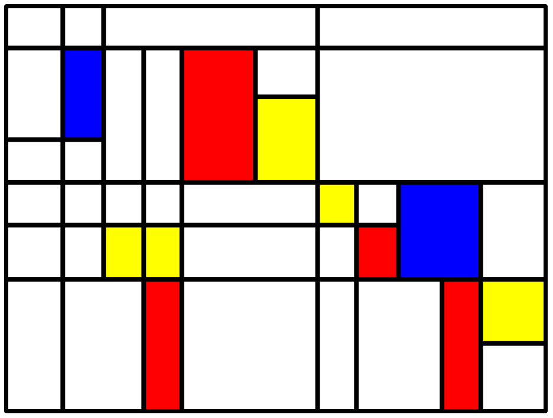
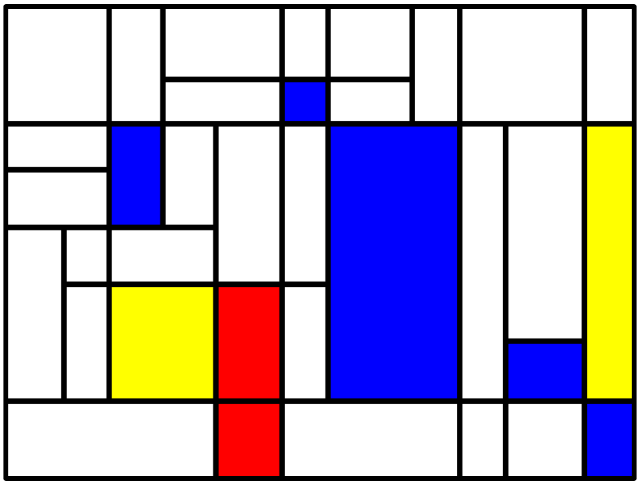
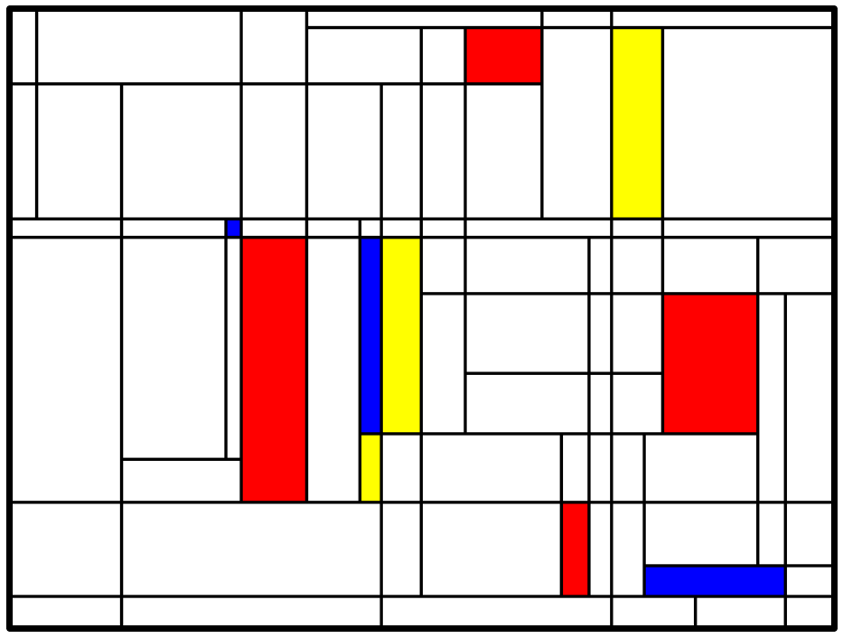

# Piet

This program allows the user to create random Mondrian-style drawings. 

If you need to print never-repeating Mondrian-style wallpaper or textile, this program is your friend. 

 

 

Go try it out: 
 <a href="https://nialvo.github.io/Piet/" target="_blank" >Visit page</a> 

For all inquiries, please contact me: 
<a href = "mailto: pilibili@protonmail.com">Send Email</a>

